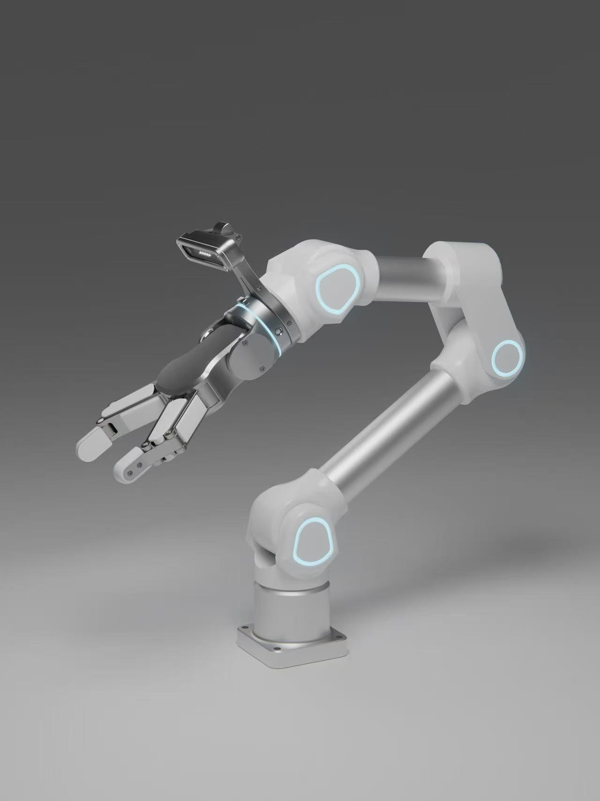

# Orca
Tutorials offer step-by-step guidance on utilizing the Orca Arm in Lerobot framework.

# ORCA Robotic Arm

## Concept
The ORCA is a research-grade, 6-DOF robotic arm that bridges the critical gap between industrial hardware and the world of embodied AI research. The product is in its late development stage, with hardware design and core software integration already complete. Its concept is to provide a **turnkey solution for robotic imitation learning**.  

Unlike other systems that require users to spend months integrating hardware with complex software, ORCA works out-of-the-box, providing a seamless workflow from data collection to AI model deployment.

## Key Features
- **Axis Configuration**: Industrial-grade 6-Degrees-of-Freedom (6-DOF) articulation, enabling complex manipulation and orientation for sophisticated tasks.  
- **Hardware Platform**: Robust construction utilizing high-precision decelerated motors, ensuring the repeatability and reliability required for industrial scenarios and consistent AI data collection.  
- **Embodied Intelligence Integration**: Natively and fully integrated with core embodied intelligence algorithm frameworks, including **LeRobot** and **ALOHA**.  

# The Unique Proposition of ORCA Arm

## 1. Standardized Mechanical Arm Interface
The standardized interface on the ORCA mechanical arm serves as a game-changer. It adheres to industry-recognized standards, ensuring compatibility with an extensive array of third-party devices.  

- **In R&D labs**: Researchers can easily attach specialized sensors for advanced data collection, such as high-precision force sensors to study the interaction forces during object manipulation.  
- **In industrial production lines**: It can be quickly interfaced with existing automated material handling systems, streamlining the overall production process.

---

## 2. Comprehensive Data Collection Platform
ORCA's data collection platform is both comprehensive and user-friendly. It automatically logs a vast amount of data during the arm's operation, including real-time joint angles, motor torque values, and sensor-based environmental data.  

- **Structured storage**: Data is stored in a format ready for immediate analysis or training AI models.  
- **Example use case**: In industrial quality control, the collected data can detect patterns that indicate product defects, enabling preventive maintenance and improving overall product quality.

---

## 3. Completed Software Algorithm Framework
With its software algorithm framework already completed and compatible with major open-source AI ecosystems, ORCA provides a significant edge.  

- **For AI startups**: They can immediately start developing embodied intelligence applications without spending months on integration.  
- **For industrial enterprises**: AI-driven automation tasks such as object recognition and motion planning are ready-to-use, reducing development time from months to weeks.

---

## 4. Scalability for Different Applications
ORCA is highly scalable, suitable for a wide spectrum of applications.  

- **In education**: Multiple ORCA arms can be networked to create a multi-robot learning environment, enabling students to experiment with collaborative robotics.  
- **In manufacturing**: A fleet of ORCA arms can be deployed across different stations, each performing specialized tasks.  
- **In software**: The open-source nature allows developers to extend functionality with new features as needed.

---

## 5. Quick Deployment and Low-Maintenance Design
Designed for quick deployment, ORCA can be set up and running in a short time.  

- **Modular mechanical structure**: Easy to assemble components for faster deployment.  
- **Low maintenance**: High-quality materials and design minimize downtime.  
- **Impact**: In industrial settings, this means higher productivity with reduced interruptions; for individuals or small businesses, it ensures immediate usability without complex maintenance procedures.
